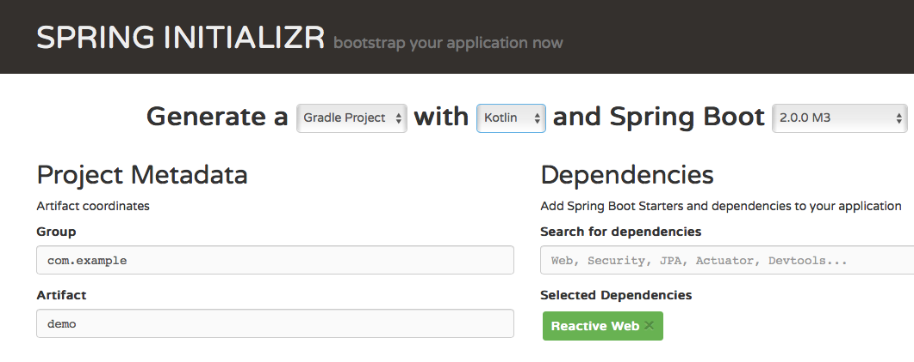

# Spring 5.0 - even fancier

If you’re not familiar with my articles, have a look at the other Kotlin related posts
[here](https://blog.simon-wirtz.de/category/kotlin/). Besides Kotlin, I’ve always been interested in working with **[Spring](https://spring.io)** ever since I started with Java back in 2011. I still like the framework although it’s getting bigger and bigger and you often don’t quite know which feature to choose amongst all the
alternatives. As the framework itself is growing, the [documentation](https://docs.spring.io/spring/docs/5.0.1.RELEASE/spring-framework-reference/), which is one of best you’ll ever get to see, also is.

The thing I like most about Spring is that you can focus on your business logic from day one and don’t have much technical, infrastructural stuff to set up before kicking off. Spring does that by encapsulating a lot of boilerplate that’s necessary for certain tasks and provides simple annotations we can apply in order to make use of
these features. One of the most famous modules certainly is [Spring Web MVC](https://docs.spring.io/spring/docs/5.0.1.RELEASE/spring-framework-reference/web.html#spring-web), which is widely used whenever it comes to web services on the JVM.

## Reactive Programming - The non-blocking way

You might have noticed, that [Reactive Programming](https://www.reactivemanifesto.org) is getting more attention recently. There are many frameworks emerging that want to encourage this style of programming, namely
[RxJava](https://github.com/ReactiveX/RxJava), [Vert.X](http://vertx.io) or [Akka](http://akka.io) for example. If you’ve never come across these, you can read my post on [Kotlin with Vert.X](https://blog.simon-wirtz.de/setup-vert-x-application-written-in-kotlin-gradle-build/) as a first step.

### Spring reactive

What does this have to do with Spring though? Well, of course, there’s yet another library for building reactive systems, which in fact is powered by Spring: [Project Reactor](https://projectreactor.io). Reactor is used in the current Spring Release 5.0, released in September, which introduces a **reactive web framework** called [**WebFlux**(https://docs.spring.io/spring/docs/5.0.1.RELEASE/spring-framework-reference/web-reactive.html#spring-webflux).  
This fact on its own is a good reason for me to dive into it as it sounds fairly fantastic knowing Web MVC as Spring's outstanding module already. But, there’s yet another great reason to take this expansion into account: Spring is greatly supporting **Kotlin** and even introduced *Kotlin dedicated* features with the recent major release :) This was achieved by making use of extension functions in order to extend existing APIs and also by introducing Kotlin DSLs, also a topic I’m really interested in, as you can read in my post on [creating a DSL with Kotlin](https://blog.simon-wirtz.de/creating-dsl-with-kotlin-introducing-a-tlslibrary/). One of these new DSLs goes hand in hand with Spring **WebFlux**: A functional DSL for describing the WebFlux-backed web service. This, in fact, is what I am going to present to you in a very short example up next…

## WebFlux and Kotlin in Action

Let’s have a look at a very basic application using *Spring WebFlux* in a *Kotlin* application. The initial setup can easily be downloaded as a **SpringBoot** application from [Spring Initializr](https://start.spring.io), if you choose Kotlin as the programming language and also enable the "Reactive Web" dependency, which is available since SpringBoot 2.0.0.



As soon as we’ve imported this project into our IDE, we can start with creating a reactive web service. For the sake of brevity, I chose a very simple, not very useful, example: An internally managed repository of
simple `String`s that is populated through the web interface and also is searchable from it. Thanks to Kotlin, and also Spring, there's not much code to be written:

**Repo and Handler**
```kotlin
@Component
class ReactiveHandler(val repo: StringRepo) {
    fun getText(search: String): Mono<String> =
        repo.get(search).toMono().map { "Result: $it!" }
    fun addText(text: String): Mono<String> =
        repo.add(text).toMono().map { "Result: $it!" }
    fun getAllTexts(): Flux<String> =
        repo.getAll().toFlux().map { "Result: $it" }
}

@Component
class StringRepo {
    private val entities = mutableListOf<String>()
    fun add(s: String) = entities.add(s)
    fun get(s: String) = entities.find { it == s } ?: "not found!"
    fun getAll() = listOf(entities)
}
```

We simply create a repository that maintains a list of `String`s and another class `ReactiveHandler`, which is responsible for delegating to the repository and providing "reactive types" defined in Reactor. These are mandatory for WebFlux: `Flux` and `Mono` (Read about them [here](https://github.com/reactor/reactor-core)). Regardless of their intention, have a look at how they are created: `toMono()` and `toFlux()` are examples of extension functions added in Spring 5.0, a feature dedicated to Kotlin. The much more interesting part though is where the web routing is defined. This part, in particular, is where the already mentioned functional DSL comes into play. Let’s observe how it works.

**Functional WebFlux DSL.**
```kotlin
@Configuration
class RoutingConfiguration {

    @Bean
    fun routerFunction(handler: ReactiveHandler): RouterFunction<ServerResponse> = router {
        ("/reactive").nest {
            val searchPathName = "search"
            val savePathName = "save"
            GET("/{$searchPathName}") { req ->
                val pathVar = req.pathVariable(searchPathName)
                ServerResponse.ok().body(
                        handler.getText(pathVar)
                )
            }
            GET("/") {
                ServerResponse.ok().body(handler.getAllTexts())
            }
            PUT("/{$savePathName}") { req ->
                val pathVar = req.pathVariable(savePathName)
                ServerResponse.ok().body(
                        handler.addText(pathVar)
                )
            }
        }
    }
}
```

The `router` function is the entry point of the new DSL, whose definition you can observe on [GitHub](https://github.com/spring-projects/spring-framework/blob/master/spring-webflux/src/main/kotlin/org/springframework/web/reactive/function/server/RouterFunctionDsl.kt). The shown solution is just one out of many since the DSL provides more ways you can choose from. With my definition, the server starts a web service under "/reactive" and accepts two **GET**
and one *PUT* request, each of which is delegated to the previously shown `ReactiveHandler` (see method parameter) before the results are put into a `ServerResponse`. Of course, you’d have to handle errors in a real-world scenario and "ok" wouldn’t be the only response.  

### Benefit

If you ask me, this approach is very clean structured and even provides the opportunity of using any Kotlin code for defining variables, loops, conditions, whatsoever inside the actual DSL code. Given that, you have
a very powerful tool that can be utilized in a very natural programmatic way.

If your like to check this out, the code is available in my [repository](https://github.com/s1monw1/SpringWebFluxKotlin).

## Wrap-up and Perspective

I’ve presented a small project that’s making use of Spring 5.0 and its new module WebFlux in combination with Kotlin. I think, the fact, that Spring officially uses and supports Kotlin is a **very** important one, I’d like to emphasize once again.

### Kotlin - It’s not only Android!

We all know that Kotlin made its way into Android, which was possible because Google announced the official support a few months ago. On the server-side though, people and especially companies hesitate when it
comes to Kotlin. They tend to have doubts as to whether Kotlin’s really mature enough already.  
When you [ask me](https://twitter.com/s1m0nw1/status/895752250144022528), there’s no good reason for hesitation. Many projects use Kotlin already, frameworks support Kotlin and even extend their libraries with dedicated Kotlin
features. Spring, as one of the most common Java frameworks, seems to think the same as they quickly adopted Kotlin as an [alternative](https://spring.io/blog/2016/02/15/developing-spring-boot-applications-with-kotlin)
to Java and Groovy for SpringBoot applications. The most recent developments, which are part of Spring 5.0, are the next step, some of which we’ve observed in this little article. If you’re, same as me, interested in spreading Kotlin as an alternative to Java, talk about it and tell your colleagues about Spring’s support and what’s actually
happening ;-)

### Special Thanks

As you can read in this [article](https://spring.io/blog/2017/01/04/introducing-kotlin-support-in-spring-framework-5-0), Spring’s introducing quite a few Kotlin features. There’s one guy, **Sébastien Deleuze**, who’s highly responsible for this development in
the Spring Framework. He has also been part of [talkingkotlin](http://talkingkotlin.com/spring-boot-with-sebastian-delueze/)
already, as one of the first discussion partners of Hadi Hariri. It’s really great to have such influencers in the Kotlin community, many thanks to you! **Keep up the great work** :)

If you like to have a look at my examples, the code is available here:
[Git](https://github.com/s1monw1/SpringWebFluxKotlin). Feel free to give any feedback, I’m always happy to help. Also, if you like, have a look at my [Twitter](https://twitter.com/s1m0nw1) account and follow if you’re interested in more Kotlin stuff :) Thanks a lot.